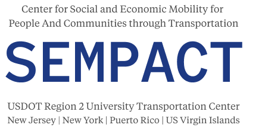



Transportation Systems Modeling and Analysis
---

### Connected Vehicle System Analysis
- Analytical modeling of information propagation in a connected vehicle system
- Analysis of information diffusion in a connected vehicle system with communication congestion
- Analysis of the interplay between traffic flow and information flow
- Information provision strategies
- Traffic flow evolution after network disruption

### Traffic Flow Evolution After Network Disruption
- Theoretical models for characterizing traffic flow evolution after network disruption
- Approximation models to enhance the applicability of traffic flow evolution models
- Formulation of travelers' travel choice evolution on the basis of behavioral game theory
- Paradox and irrational behavior

### Transportation Network Evacuation
- Dynamic resource allocation problem for transportation network evacuation
- Shelter location and contraflow operations
- Bender’s decomposition scheme for large-scale network evacuation problems

Traffic Management and Operations
---

### Energy Optimal Control for Mixed Traffic Flow
- Optimal speed trajectory for electric vehicles on signalized arterials
- Analysis of electric vehicle energy consumption on a signalized corridor
- Energy-optimal traffic control in a connected-vehicle environment
- Optimal signal control to maximize energy efficiency of mixed traffic
- Charging station location for electric vehicles

### Congestion Pricing
- Bounded-flow congestion pricing problem and projection-based solution algorithms
- Estimation of time-dependent value of travel time and value of reliability
- Income-equitable toll pricing
- Regularization for the minimum toll booth problem
- Benefit-cost analysis of HOT lanes

Infrastructure System Resilience
---

### Transportation Network Reliability Assessment
- Transportation system vulnerability assessment using historical disaster data and GIS information
- Stochastic optimization model to strengthen transportation system reliability
- Resource allocation model for humanitarian supply to enhance the system recovery process after disaster

### Interdependent Infrastructure Network Resilience
- Resilience investigation of interdependent infrastructure systems using data from the Mekong Delta
- Development of an optimization model to enhance interdependent infrastructure systems' resilience

Team Members
---

### Ph.D. Students
- Ms. Xiaoyu Ma, PhD, Aug. 2019 - August 2024
  * First employment: Postdoc @ Carnegie Mellon University
  * Won the 2023 WTS Helene M. Overly Memorial Scholarship
  * Won the 2022 Founders Award of Excellence
  * Won the 2021 Belsky Award for Computational Sciences and Engineering
- Mr. Yu Wei, PhD, Aug. 2018 - May 2023
  * First employment: Transportation Modeler @ The Corradino Group
- Mr. Chunheng Jiang, Computer Science (Co-advised with Prof. Jianxi Gao) May 2018 - May 2022
  * First employment: Machine Learning Engineer @ Google

### Visiting Scholars
- Mr. Pengcheng Wang, PhD, Oct. 2018 - Oct. 2019, Beihang University
- Mr. Yi Zhang, Dec. 2017 - Dec. 2018, Beijing University of Posts and Telecommunications

### Undergraduate Research Assistant
- Ms. Carrie M. Conton, Summer 2019, Mechanical Engineering
  * Won a travel award to present her research at UTRC’s Transportation Technology Symposium
  * Enrolled into the Masters of Urban Planning at Texas A&M University Fall, 2024

### High school Research Intern
- Ms. Saanvi Sharma, May 2024~present
  * Project won a grand prize in the engineering category at Synopsys Science Fair 2024

### Research group photo

HEX Lab members in 2019 (from left to right): Dr. He, Carrie M. Conton, Pengcheng Wang, Yu Wei, and Wenjing Zhang.

We gratefully acknowledge the funding support of the following agencies:
---

**NSF, DOE, DOT**

**IBM**

**SEMPACT, CITE, CoE-SUFS** Centers

And our collabrators:
----
CLR Analytics, Price Chopper, CDTA
